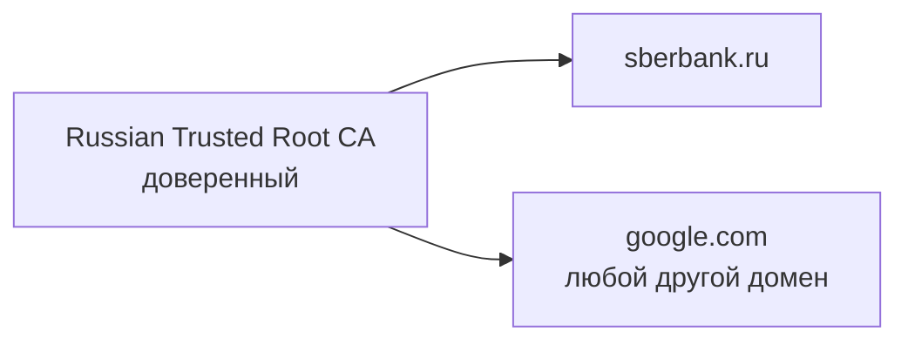
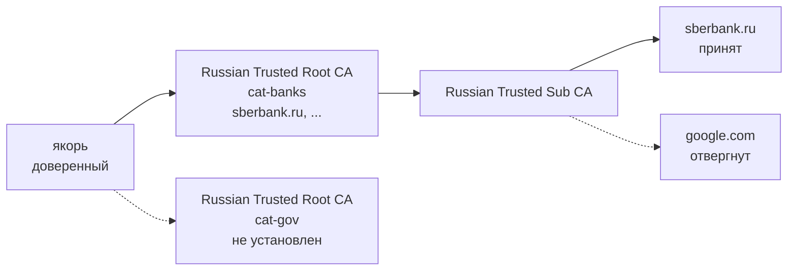
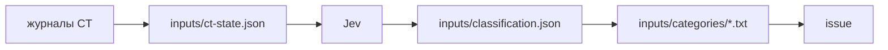

# meanziphra

meanziphra lets a Mac or a Linux machine trust the Russian Ministry of Digital Development root CA only for the domains
it issued certificates to, split into categories you choose to install. The rest of this document is
in Russian.

meanziphra позволяет Mac или Linux доверять корневому УЦ Минцифры только на тех доменах, которым он выдавал
сертификаты, с разбивкой на категории: ставить можно только нужные.

Термины — в [глоссарии](GLOSSARY.md).

## TL;DR

```sh
curl -fsSL https://github.com/mikluko/meanziphra/releases/latest/download/install.sh | bash -s -- banks gov
```

> **Внимание:** в наше время нельзя доверять никому, в том числе мне. Эта команда скачивает
> программу `mz`, которая выпускает якорь на вашем компьютере и ставит его; ключ якоря не покидает машину.
> Доверять приходится коду, а его можно [проверить](#проверка-сборки). Подробности — в разделе
> [Модель доверия](#модель-доверия), список категорий — в разделе [Категории](#категории).

## Установка

### Одной командой

```sh
curl -fsSL https://github.com/mikluko/meanziphra/releases/latest/download/install.sh | bash -s -- banks gov
```

`install.sh` скачивает `mz` для вашей системы и архитектуры из того же релиза и сверяет его SHA-256,
вписанный в сам скрипт; если установлен `gh`, ещё и аттестацию. Затем запускает `mz install` с теми
же аргументами: `mz` выпускает якорь и кросс-сертификаты выбранных категорий, удаляет прежние
сертификаты якоря и ставит новые. `all` ставит все категории. Куда ставятся сертификаты:

- **macOS** — связка ключей login; macOS спросит пароль, чтобы доверять якорю.
- **Linux** — системное хранилище корневых сертификатов (`update-ca-certificates` в Debian и Ubuntu,
  `update-ca-trust` в Fedora и RHEL), им пользуются curl, wget, Python и всё, что на OpenSSL или
  GnuTLS; для этого `mz` запустит установку через `sudo`. Если есть `certutil` и база NSS
  пользователя `~/.pki/nssdb`, сертификаты ставятся и туда: её читает Chrome. Firefox держит свою
  базу в каждом профиле; в него импортируйте файлы из [бандла](#бандл-для-другого-компьютера) в
  **Настройки > Приватность и защита > Сертификаты**.

Удаление всех сертификатов якоря на Mac:

```sh
curl -fsSL https://github.com/mikluko/meanziphra/releases/latest/download/uninstall.sh | bash
```

На Linux удаляет `mz uninstall` или `uninstall.sh` из бандла.

### Программой mz

`mz` можно скачать со [страницы релиза](https://github.com/mikluko/meanziphra/releases/latest)
(`mz-darwin-*` для macOS, `mz-linux-*` для Linux) или поставить из исходников:

```sh
go install github.com/mikluko/meanziphra/cmd/mz@latest
mz install banks gov
```

Конфиг релиза, корень и списки доменов встроены в `mz`. По умолчанию ключ якоря эфемерный: он живёт
только в памяти во время работы `mz`, и каждый запуск выпускает новый якорь, которому система снова
попросит доверие. Чтобы обновлять категории без нового доверия, храните ключ в 1Password:
`mz install -key op://… banks gov`. Ключ в файле `mz` принимает только с флагом `-insecure`:
`mz install -insecure -key ~/.config/meanziphra/anchor.key banks gov` (отсутствующий файл будет
создан). Удаление: `mz uninstall`.

### Бандл для другого компьютера

```sh
mz bundle -o meanziphra-bundle banks gov                  # для Mac
mz bundle -target linux -o meanziphra-bundle banks gov    # для Linux
```

Каталог `meanziphra-bundle` содержит `anchor.crt`, кросс-сертификаты и скрипты `install.sh` и
`uninstall.sh`. Перенесите его на другой компьютер и выполните там `bash meanziphra-bundle/install.sh`:
скрипт сверит SHA-256 файлов и поставит их без сети, на Linux — через `sudo`. Бандл для Mac несёт по
файлу `cat-<категория>.crt` на категорию, и его `install.sh` может поставить только часть из них.
Бандл для Linux несёт один `cross-nca.crt` на все выбранные категории: OpenSSL из нескольких
кросс-сертификатов одного корня берёт первый и другие не пробует.

На Mac бандл можно поставить и через Связку ключей:

1. Откройте **Связку ключей** и выберите связку **login**.
1. Выберите **Файл > Импортировать объекты** и импортируйте файлы `.crt` из бандла.
1. Дважды щёлкните сертификат «Минцифры на поводке».
1. Разверните **Доверие** и установите **При использовании этого сертификата** в **Всегда доверять**.
1. Закройте окно и введите пароль.

Кросс-сертификатам, которые называются «Russian Trusted Root CA», доверие не нужно.

### Проверка сборки

Аттестация связывает бинарник с коммитом и workflow, которые его собрали:

```sh
tag=$(gh release view -R mikluko/meanziphra --json tagName --jq .tagName)
gh release download "$tag" -R mikluko/meanziphra -p 'mz-*' -p '*.sh' -D "meanziphra-$tag"
for f in "meanziphra-$tag"/*; do gh attestation verify "$f" -R mikluko/meanziphra; done
```

Сборка воспроизводима: тот же коммит и та же версия Go дают побайтно тот же бинарник, так что его
можно собрать самому и сравнить:

```sh
git clone https://github.com/mikluko/meanziphra.git && cd meanziphra
git checkout "$tag"
make binaries
shasum -a 256 build/mz-* "../meanziphra-$tag"/mz-*
```

## Категории

*Категории в `config.release.yaml`*

| Категория      | Что входит                                                                  |
|----------------|-----------------------------------------------------------------------------|
| `banks`        | банки, страхование, брокеры, НПФ, платёжные системы                         |
| `gov`          | органы власти, госучреждения, государственные больницы, школы и вузы        |
| `telecom`      | операторы связи                                                             |
| `marketplaces` | маркетплейсы и розница                                                      |
| `internet`     | интернет-сервисы, СМИ, облака, разработчики программ                        |
| `transport`    | транспорт и логистика                                                       |
| `industry`     | промышленность, энергетика, добыча, строительство                           |
| `other`        | всё остальное                                                               |

Домены каждой категории лежат в `inputs/categories/<категория>.txt`.

## Мотивация

Непосредственная польза — открывать российские сайты, не доверяя корню Минцифры больше, чем нужно.

Вторая цель — испытать подходы к автоматизации с помощью ИИ. Узким местом в последнее время стала
механическая работа вокруг кода: обновить данные, разложить их, собрать релиз, написать CHANGELOG.
Здесь эта работа разделена по тому, насколько ей можно доверять:

- **Детерминированное — в коде.** Чтение журналов CT, проверка подписей, выпуск сертификатов и
  проверки в CI делает программа, и её результат воспроизводим.
- **Суждение — узкими вызовами модели.** Jev отвечает на один вопрос с типизированным ответом и
  уверенностью; ответы хранятся в репозитории, модель спрашивают только о новом, а изменения видны в
  диффе.
- **Рутина — агенту.** Агент на goose и Kimi K3 собирает PR ботов в стек, пишет CHANGELOG, выбирает шаг
  версии и сливает релиз. Что ему делать, описано в `.github/release-agent.md`, а всё, что он меняет,
  проходит через PR и CI.
- **Проверяемость — на выходе.** Каждый релиз аттестован, так что видно, каким кодом он собран.

## Проблема

Многие российские сайты, в том числе банки, используют сертификаты от Russian Trusted Root CA.
Safari, Chrome и Firefox этому корню не доверяют, и сайты не открываются.

Если доверить корень целиком, сайты откроются, но владелец корня сможет выпустить сертификат на
любой домен, например `google.com` или домен вашей почты, и Mac его примет. Настройки доверия macOS
применяются к корню целиком и не ограничиваются доменами.



*Доверие корню напрямую: доступен любой домен.*

## Решение

Расширение X.509 *name constraints* ограничивает домены, на которые УЦ может выпускать
сертификаты, и все сертификаты ниже по цепочке наследуют это ограничение. Корень Минцифры уже
выпущен и изменить его нельзя, поэтому meanziphra его перевыпускает:

1. `issue` создаёт локальный корень, *якорь*. Доверять нужно только ему.
1. На каждую категорию якорь подписывает *кросс-сертификат*: копию корня Минцифры с тем же именем
   и открытым ключом и с ограничением на домены категории.
1. Цепочка сайта упирается в ключ корня Минцифры. Система находит для этого ключа установленный
   кросс-сертификат и доходит через него до якоря, собирая по пути ограничение.



*Доверие якорю: цепочка проходит через ограничение установленной категории.*

Сайт категории, кросс-сертификат которой не установлен, не откроется: цепочку до якоря не
построить. Сам якорь ограничен зонами доменов всех категорий, так что даже его ключ не подпишет
сертификат на `google.com`; macOS, OpenSSL, GnuTLS, NSS и Go это ограничение у доверенного корня
соблюдают. Ограничить якорь самими доменами нельзя: macOS отвергает сертификат, в котором больше 1023
ограничений. По той же причине на Mac категория больше 1000 доменов выпускается несколькими
кросс-сертификатами в одном файле `cat-<категория>.crt`, и macOS сам выбирает подходящий. В Linux
так нельзя: OpenSSL из нескольких кросс-сертификатов одного корня берёт первый, поэтому там один
кросс-сертификат несёт все выбранные домены, а предела в 1023 у OpenSSL, GnuTLS и NSS нет.

`issue` отказывается работать с корнем, SHA-256 которого не совпадает с `sha256` в конфиге.
Категорию без доменов `issue` пропускает: кросс-сертификат без ограничений доверял бы корню целиком.

## Модель доверия

Установив сертификаты, вы доверяете не только корню Минцифры: доверенным становится якорь, и
важно, у кого его закрытый ключ.

*Кому вы доверяете*

| Способ                     | Кто держит ключ якоря         | Чему вы доверяете                        | Как проверить                              |
|----------------------------|-------------------------------|------------------------------------------|--------------------------------------------|
| `install.sh` и `mz install`| только `mz` на вашем компьютере | коду `mz` из релиза                      | аттестация и воспроизводимая сборка        |
| `mz`, собранный самим      | только `mz` на вашем компьютере | исходникам, которые вы собрали           | прочитать код                              |
| бандл с другого компьютера | тот, кто собрал бандл         | этому человеку и его `mz`                | спросить у него                            |

По умолчанию ключ якоря *эфемерный*. `mz` создаёт его в начале работы, подписывает им якорь и
кросс-сертификаты и больше ничего с ним не делает: ключ никуда не записывается — ни на диск, ни в
связку ключей, ни в сеть — и существует только в памяти процесса `mz`. Когда `mz` завершается, эта
память освобождается, и ключ исчезает вместе с ней. Восстановить ключ после этого неоткуда, а
значит, и утекать нечему:
якорем, который вы установили, никто больше не подпишет ни одного сертификата, включая вас самих.
Цена — каждый следующий запуск `mz install` выпускает новый якорь, и macOS снова спрашивает
пароль, чтобы ему доверять.

Чтобы ключ не попал на диск в обход этого, `mz install`, `mz bundle` и `mz issue` перед работой
проверяют подкачку, куда система может вытеснить память процесса, и не запускаются, если она не
шифруется. В macOS `mz` спрашивает об этом ядро системным вызовом `sysctl` (`vm.swapusage`). В Linux
такого вызова нет, и `mz` разбирает каждую подкачку из `/proc/swaps`: она должна лежать в памяти
(zram) или на dm-crypt, в том числе через LVM; подкачки нет совсем — тоже годится. На других ОС
проверить нечем, и `mz` откажется работать. Дамп памяти при падении `mz` запрещает себе сам.

Ключ, который `mz` хранит по `-key`, напротив, переживает запуск: кто его получит, сможет выпустить
сертификат на любой домен в зонах якоря. Ключ в 1Password (`op://`) на диск не попадает и
разрешён всегда. Ключ в файле `mz` принимает только с флагом `-insecure`, и он же отключает проверку
подкачки: без этого флага ключ не окажется на диске ни в каком виде.

Корень Минцифры при этом ограничен доменами установленных категорий, а якорь — зонами `.ru`, `.su`
и `.рф`: даже утёкший ключ якоря не подпишет `google.com`.

## Откуда берутся домены

`update` читает журналы Certificate Transparency, куда НУЦ записывает выпущенные сертификаты, по
[RFC 6962](https://www.rfc-editor.org/rfc/rfc6962.html). Подлинность каждой записи проверяется по
цепочке до закреплённого корня. В список попадают действующие сертификаты в зонах `.ru`, `.su` и
`.рф`; поддомены, покрытые своим доменом, отбрасываются.

Категорию определяет владелец сертификата: организация, ИНН и ОГРН из subject. Владельцев размечает
модель Jev от [TypeSafe](https://typesafe.ai), выбирая категорию по описаниям из конфига. Все домены
одного ОГРН попадают в одну категорию. Разметка хранится в `inputs/classification.json`, и модель
спрашивают только про новых владельцев; ответы с уверенностью ниже `min_confidence` помечены
`review`.



*Путь домена от журнала до кросс-сертификата.*

## Как выходят релизы

Всё, что меняет входные данные, приходит пулл-реквестами: ежедневный workflow `update` ведёт PR с
новыми доменами, Renovate открывает PR с обновлениями зависимостей. Раз в день агент (goose на
Kimi K3) собирает зелёные PR с меткой `bot` в стек (`gh stack`), кладёт сверху ветку
`release/v<версия>` с `CHANGELOG.md` и атомарно сливает стек в `main`; после этого workflow
`release` собирает `mz` и публикует его вместе с `install.sh` и `uninstall.sh`. Сертификаты релиз
выпускает только для проверки и не публикует. Порядок действий агента описан в
`.github/release-agent.md`.

Релизы помечены тегом `vA.B.C`. Списки доменов лежат в репозитории, поэтому их обновление — тоже
новая версия, patch.

## Настройка сборки

Без `-c` программа `mz` берёт встроенный конфиг релиза. Команды сопровождения работают с файлом:

```sh
go run ./cmd/mz -c config.release.yaml update
go run ./cmd/mz -c config.release.yaml issue
go run ./cmd/mz -c config.release.yaml check
```

Все поля конфига с пояснениями собраны в `config.example.yaml`. Свои категории задаются в
`categories`: описание категории уходит в Jev как критерий выбора. Чтобы разметить домены по своим
категориям, `update` нужен ключ TypeSafe в `TYPESAFE_API_KEY`; при смене модели, инструкции или
категорий разметка начинается заново.

`issue` пишет `build/anchor.crt` и `build/cat-<категория>.crt`. `check` подключается к хостам из
`check` и завершается с ошибкой, если хост не пропущен или не отвергнут так, как указано.
`make binaries` собирает `mz` для macOS и Linux, arm64 и amd64, в `build/`.

Чтобы якорь сохранялся между запусками, задайте в `anchor.key` ссылку `op://` на 1Password или,
с флагом `-insecure`, путь к файлу; флаг `-key` делает то же без правки конфига. Отсутствующий файл
будет создан. Якорь меняется, только когда меняется набор зон доменов. В CI `issue` запускается с
`-insecure`: раннеры на Linux, проверить там шифрование подкачки нечем, а выпущенные сертификаты не
публикуются.

Все входные данные сборки лежат в `inputs/`. Когда Минцифры перевыпустит корень, замените `sha256`
корня в `config.release.yaml` и выполните `go run ./cmd/mz -c config.release.yaml fetch`: команда
скачает сертификат с `url` и запишет его в `cert`, только если его SHA-256 совпадает с `sha256`.

## Альтернативы

Корень Минцифры можно не ограничивать доменами, а изолировать в отдельном браузере. Тогда
доверие к нему действует на любые домены, но только внутри этого браузера.

*Где действует доверие к корню Минцифры*

| Вариант                    | Какие приложения                  | Какие домены                                    |
|----------------------------|-----------------------------------|-------------------------------------------------|
| meanziphra                 | все, что используют системное доверие | только установленных категорий              |
| Отдельный профиль Firefox  | только этот профиль Firefox       | любые                                           |
| Яндекс Браузер             | только Яндекс Браузер             | любые                                           |
| Корень в связке ключей     | все, что используют доверие macOS | любые                                           |

### Отдельный профиль Firefox

У каждого профиля Firefox собственное хранилище сертификатов, поэтому корень, импортированный в
одном профиле, не действует ни в других профилях, ни в остальной системе.

1. Откройте `about:profiles` и создайте профиль, например «Минцифры».
1. Запустите Firefox в этом профиле.
1. Откройте **Настройки > Приватность и защита > Сертификаты > Просмотр сертификатов**.
1. На вкладке **Центры сертификации** импортируйте `inputs/russian-trusted-root-ca.pem` и отметьте
   **Доверять при идентификации веб-сайтов**.

Внутри этого профиля корень может подтвердить подлинность любого сайта. Открывайте в нём только
российские сайты и не входите в нём в почту и другие аккаунты.

### Яндекс Браузер

Корень Минцифры встроен в Яндекс Браузер, устанавливать ничего не нужно, и системное хранилище
macOS он не меняет. Списка доменов, которыми Яндекс Браузер ограничивает это доверие, Яндекс не
публиковал, поэтому исходите из того, что ограничения нет: внутри браузера корень может подтвердить
подлинность любого сайта. Кроме того, вы доверяете самому браузеру и его разработчику.
