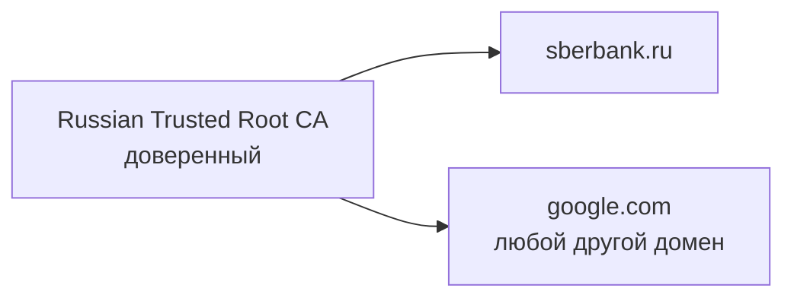
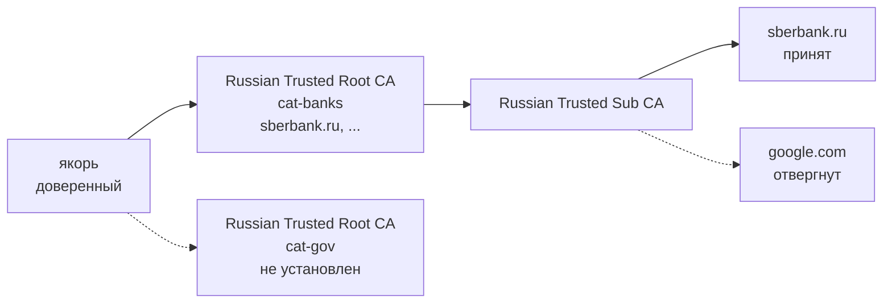
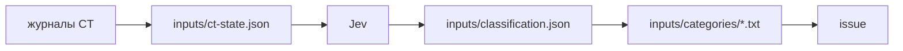

# meanziphra

meanziphra lets a Mac trust the Russian Ministry of Digital Development root CA only for the domains
it issued certificates to, split into categories you choose to install. The rest of this document is
in Russian.

meanziphra позволяет Mac доверять корневому УЦ Минцифры только на тех доменах, которым он выдавал
сертификаты, с разбивкой на категории: ставить можно только нужные.

## TL;DR

Безопаснее всего собрать сертификаты самому: нужны Go и клон репозитория.

```sh
git clone https://github.com/mikluko/meanziphra.git && cd meanziphra
go run . issue && go run . -only banks,gov install
```

Или поставить готовый релиз одной командой, доверившись нам (см. [Из релиза](#из-релиза)):

```sh
curl -fsSL https://github.com/mikluko/meanziphra/releases/latest/download/install.sh | bash -s -- banks gov
```

Список категорий — в разделе [Категории](#категории).

## Установка

### Своя сборка

```sh
git clone https://github.com/mikluko/meanziphra.git
cd meanziphra
go run . issue
go run . check
go run . -only banks,gov install
```

`check` проверяет выпущенные сертификаты на живых сайтах. `install` попросит пароль macOS, чтобы
доверять якорю; без `-only` ставятся все категории. Ключ якоря существует только в памяти во время
`issue`, поэтому подписать им что-то ещё не сможет никто, включая вас. Удаление:
`go run . uninstall`.

### Из релиза

> **Внимание:** устанавливая готовый якорь, вы доверяете не только корню Минцифры, но и нам.
> Якорь ограничен зонами `.ru`, `.su` и `.рф`: внутри них его ключом можно подписать сертификат на
> любой домен, например на вашу почту в `.ru`. Релиз собирается в GitHub Actions с эфемерным ключом,
> но проверить, что ключ уничтожен, вы не можете. Если можете собрать сами, собирайте.

[Последний релиз](https://github.com/mikluko/meanziphra/releases/latest) содержит `anchor.crt`, по
файлу `cat-<категория>.crt` на категорию и скрипты `install.sh` и `uninstall.sh`.

```sh
curl -fsSL https://github.com/mikluko/meanziphra/releases/latest/download/install.sh | bash -s -- banks gov
```

`install.sh` скачивает файлы своего релиза и сверяет их SHA-256, вписанные в сам скрипт; если
установлен `gh`, ещё и аттестацию каждого файла. Затем он удаляет прежние сертификаты якоря, ставит
новый якорь в доверенные (macOS спросит пароль) и добавляет кросс-сертификаты выбранных категорий.
`all` ставит все категории, запуск без аргументов печатает их список. Конкретный релиз ставится
скриптом по его тегу: `https://github.com/mikluko/meanziphra/releases/download/<тег>/install.sh`.

Удаление всех сертификатов якоря:

```sh
curl -fsSL https://github.com/mikluko/meanziphra/releases/latest/download/uninstall.sh | bash
```

### Через Связку ключей

1. Скачайте `anchor.crt` и нужные `cat-<категория>.crt` со страницы
   [последнего релиза](https://github.com/mikluko/meanziphra/releases/latest).
1. Откройте **Связку ключей** и выберите связку **login**.
1. Выберите **Файл > Импортировать объекты** и импортируйте скачанные файлы.
1. Дважды щёлкните сертификат «Минцифры на поводке».
1. Разверните **Доверие** и установите **При использовании этого сертификата** в **Всегда доверять**.
1. Закройте окно и введите пароль.

Кросс-сертификатам, которые называются «Russian Trusted Root CA», доверие не нужно. Перед установкой
нового релиза удалите сертификаты прежнего: каждый релиз выпускает новый якорь.

### Проверка релиза

Скачайте релиз целиком и сверьте аттестацию каждого файла:

```sh
tag=$(gh release view -R mikluko/meanziphra --json tagName --jq .tagName)
gh release download "$tag" -R mikluko/meanziphra -D "meanziphra-$tag"
for f in "meanziphra-$tag"/*; do gh attestation verify "$f" -R mikluko/meanziphra; done
```

`gh attestation verify` проверяет, что файл выпустил workflow этого репозитория, и называет коммит.
По исходникам этого коммита видно, что ключ якоря нигде не сохраняется. Скомпрометированный раннер
GitHub аттестация не исключает. Проверенный скрипт запускается из скачанного каталога:
`bash "meanziphra-$tag/install.sh" banks gov`.

## Категории

*Категории в `config.release.yaml`*

| Категория      | Что входит                                                                  |
|----------------|-----------------------------------------------------------------------------|
| `banks`        | банки, страхование, брокеры, НПФ, платёжные системы                         |
| `gov`          | органы власти, госучреждения, государственные больницы, школы и вузы        |
| `telecom`      | операторы связи                                                             |
| `marketplaces` | маркетплейсы и розница                                                      |
| `internet`     | интернет-сервисы, СМИ, облака, разработчики программ                        |
| `transport`    | транспорт и логистика                                                       |
| `industry`     | промышленность, энергетика, добыча, строительство                           |
| `other`        | всё остальное                                                               |

Домены каждой категории лежат в `inputs/categories/<категория>.txt`.

## Мотивация

Непосредственная польза — открывать российские сайты, не доверяя корню Минцифры больше, чем нужно.

Вторая цель — испытать подходы к автоматизации с помощью ИИ. Узким местом в последнее время стала
механическая работа вокруг кода: обновить данные, разложить их, собрать релиз, написать CHANGELOG.
Здесь эта работа разделена по тому, насколько ей можно доверять:

- **Детерминированное — в коде.** Чтение журналов CT, проверка подписей, выпуск сертификатов и
  проверки в CI делает программа, и её результат воспроизводим.
- **Суждение — узкими вызовами модели.** Jev отвечает на один вопрос с типизированным ответом и
  уверенностью; ответы хранятся в репозитории, модель спрашивают только о новом, а изменения видны в
  диффе.
- **Рутина — агенту.** Агент на goose и Kimi K3 собирает PR ботов в стек, пишет CHANGELOG, выбирает шаг
  версии и сливает релиз. Что ему делать, описано в `.github/release-agent.md`, а всё, что он меняет,
  проходит через PR и CI.
- **Проверяемость — на выходе.** Каждый релиз аттестован, так что видно, каким кодом он собран.

## Проблема

Многие российские сайты, в том числе банки, используют сертификаты от Russian Trusted Root CA.
Safari, Chrome и Firefox этому корню не доверяют, и сайты не открываются.

Если доверить корень целиком, сайты откроются, но владелец корня сможет выпустить сертификат на
любой домен, например `google.com` или домен вашей почты, и Mac его примет. Настройки доверия macOS
применяются к корню целиком и не ограничиваются доменами.



*Доверие корню напрямую: доступен любой домен.*

## Решение

Расширение X.509 *name constraints* ограничивает домены, на которые УЦ может выпускать
сертификаты, и все сертификаты ниже по цепочке наследуют это ограничение. Корень Минцифры уже
выпущен и изменить его нельзя, поэтому meanziphra его перевыпускает:

1. `issue` создаёт локальный корень, *якорь*. Доверять нужно только ему.
1. На каждую категорию якорь подписывает *кросс-сертификат*: копию корня Минцифры с тем же именем
   и открытым ключом и с ограничением на домены категории.
1. Цепочка сайта упирается в ключ корня Минцифры. Mac находит для этого ключа установленный
   кросс-сертификат и доходит через него до якоря, собирая по пути ограничение.



*Доверие якорю: цепочка проходит через ограничение установленной категории.*

Сайт категории, кросс-сертификат которой не установлен, не откроется: цепочку до якоря не
построить. Сам якорь ограничен зонами доменов всех категорий, так что даже его ключ не подпишет
сертификат на `google.com`; macOS и Go это ограничение у доверенного корня соблюдают. Ограничить якорь
самими доменами нельзя: macOS отвергает сертификат, в котором больше 1023 ограничений. По той же
причине категория больше 1000 доменов выпускается несколькими кросс-сертификатами в одном файле
`cat-<категория>.crt`, и macOS сам выбирает подходящий. Собрав сертификаты сами, вы знаете, что ключ
якоря уничтожен; установив готовый релиз, вы верите в это нам.

`issue` отказывается работать с корнем, SHA-256 которого не совпадает с `sha256` в конфиге.
Категорию без доменов `issue` пропускает: кросс-сертификат без ограничений доверял бы корню целиком.

## Откуда берутся домены

`update` читает журналы Certificate Transparency, куда НУЦ записывает выпущенные сертификаты, по
[RFC 6962](https://www.rfc-editor.org/rfc/rfc6962.html). Подлинность каждой записи проверяется по
цепочке до закреплённого корня. В список попадают действующие сертификаты в зонах `.ru`, `.su` и
`.рф`; поддомены, покрытые своим доменом, отбрасываются.

Категорию определяет владелец сертификата: организация, ИНН и ОГРН из subject. Владельцев размечает
модель Jev от [TypeSafe](https://typesafe.ai), выбирая категорию по описаниям из конфига. Все домены
одного ОГРН попадают в одну категорию. Разметка хранится в `inputs/classification.json`, и модель
спрашивают только про новых владельцев; ответы с уверенностью ниже `min_confidence` помечены
`review`.



*Путь домена от журнала до кросс-сертификата.*

## Как выходят релизы

Всё, что меняет входные данные, приходит пулл-реквестами: ежедневный workflow `update` ведёт PR с
новыми доменами, Renovate открывает PR с обновлениями зависимостей. Раз в день агент (goose на
Kimi K3) собирает зелёные PR с меткой `bot` в стек (`gh stack`), кладёт сверху ветку
`release/v<версия>` с `CHANGELOG.md` и атомарно сливает стек в `main`; после этого workflow
`release` выпускает сертификаты. Порядок действий агента описан в `.github/release-agent.md`.

Релизы помечены тегом `vA.B.C`. Списки доменов лежат в репозитории, поэтому их обновление — тоже
новая версия, patch.

## Настройка сборки

По умолчанию команды читают `config.release.yaml`, с которым собирается релиз. Все поля конфига с
пояснениями собраны в `config.example.yaml`; свой конфиг передаётся флагом `-c`. Свои категории
задаются в `categories`: описание категории уходит в Jev как критерий выбора. Чтобы разметить домены
по своим категориям, `update` нужен ключ TypeSafe в `TYPESAFE_API_KEY`; при смене модели,
инструкции или категорий разметка начинается заново.

`issue` пишет `build/anchor.crt` и `build/cat-<категория>.crt`. `check` подключается к хостам из
`check` и завершается с ошибкой, если хост не пропущен или не отвергнут так, как указано.
`install` приводит сертификаты этого якоря в связке ключей к выпущенным: ставит якорь и категории из
`-only` и удаляет остальные; `uninstall` удаляет все.

Чтобы якорь сохранялся между запусками, задайте в `anchor.key` путь к файлу или ссылку `op://` на
1Password. Отсутствующий файл будет создан. Якорь меняется, только когда меняется набор зон доменов.

Все входные данные сборки лежат в `inputs/`. Когда Минцифры перевыпустит корень, замените `sha256`
корня в `config.release.yaml` и выполните `go run . fetch`: команда скачает сертификат с `url` и
запишет его в `cert`, только если его SHA-256 совпадает с `sha256`.

## Альтернативы

Корень Минцифры можно не ограничивать доменами, а изолировать в отдельном браузере. Тогда
доверие к нему действует на любые домены, но только внутри этого браузера.

*Где действует доверие к корню Минцифры*

| Вариант                    | Какие приложения                  | Какие домены                                    |
|----------------------------|-----------------------------------|-------------------------------------------------|
| meanziphra, своя сборка    | все, что используют доверие macOS | только установленных категорий                  |
| meanziphra, готовый релиз  | все, что используют доверие macOS | установленных категорий; любые в `.ru`, `.su` и `.рф`, если ключ якоря не уничтожен |
| Отдельный профиль Firefox  | только этот профиль Firefox       | любые                                           |
| Яндекс Браузер             | только Яндекс Браузер             | любые                                           |
| Корень в связке ключей     | все, что используют доверие macOS | любые                                           |

### Отдельный профиль Firefox

У каждого профиля Firefox собственное хранилище сертификатов, поэтому корень, импортированный в
одном профиле, не действует ни в других профилях, ни в остальной системе.

1. Откройте `about:profiles` и создайте профиль, например «Минцифры».
1. Запустите Firefox в этом профиле.
1. Откройте **Настройки > Приватность и защита > Сертификаты > Просмотр сертификатов**.
1. На вкладке **Центры сертификации** импортируйте `inputs/russian-trusted-root-ca.pem` и отметьте
   **Доверять при идентификации веб-сайтов**.

Внутри этого профиля корень может подтвердить подлинность любого сайта. Открывайте в нём только
российские сайты и не входите в нём в почту и другие аккаунты.

### Яндекс Браузер

Корень Минцифры встроен в Яндекс Браузер, устанавливать ничего не нужно, и системное хранилище
macOS он не меняет. Списка доменов, которыми Яндекс Браузер ограничивает это доверие, Яндекс не
публиковал, поэтому исходите из того, что ограничения нет: внутри браузера корень может подтвердить
подлинность любого сайта. Кроме того, вы доверяете самому браузеру и его разработчику.
